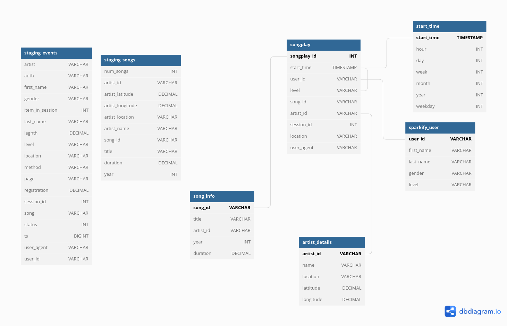

# AWS Data Warehouse


## Introduction
A music streaming startup, Sparkify, has grown their user base and song database and want to move their processes and data onto the cloud. Their data resides in S3, in a directory of JSON logs on user activity on the app, as well as a directory with JSON metadata on the songs in their app.

As their data engineer, you are tasked with building an ETL pipeline that extracts their data from S3, stages them in Redshift, and transforms data into a set of dimensional tables for their analytics team to continue finding insights into what songs their users are listening to. You will be able to test your database and ETL pipeline by running queries given to you by the analytics team from Sparkify and compare your results with their expected results.


## Database Schema

- staging_events: It stages the data to your own S3 bucket from s3://udacity-dend/log_data which is in JSON format. It is dataset of artists.
- staging_songs: It stages the data to your own S3 bucket from s3://udacity-dend/song_data which  is in JSON format. It is a song data set.
- songplay: Records in log data associated with song plays
- sparkify_user: Users in the app
- song_info: Information about Songs in music database
- artist_details: Informatin about artists in music database
- start_time: Timestamps of records in songplays broken down into specific units

## Getting started

`python create_tables.py`</br>
`python etl.py`

## Python scripts

- create_tables.py: Clean previous schema and creates tables.
- sql_queries.py: All queries used in the ETL pipeline.
- etl.py: Extracts their data from S3, stages them in Redshift, and transforms data into a set of dimensional tables.


## ETL Pipeline Details

### Source Dataset

#### Song Dataset

Each file is in JSON format and contains metadata about a song and the artist of that song. The files are partitioned by the first three letters of each song's track ID. For example, here are filepaths to two files in this dataset.

`song_data/A/B/C/TRABCEI128F424C983.json
song_data/A/A/B/TRAABJL12903CDCF1A.json
`

And below is an example of what a single song file, TRAABJL12903CDCF1A.json, looks like.
```json
{
  "num_songs": 1,
  "artist_id": "ARJIE2Y1187B994AB7",
  "artist_latitude": null,
  "artist_longitude": null,
  "artist_location": "",
  "artist_name": "Line Renaud",
  "song_id": "SOUPIRU12A6D4FA1E1",
  "title": "Der Kleine Dompfaff",
  "duration": 152.92036,
  "year": 0
}
```

#### Log Dataset

The log files in the dataset you'll be working with are partitioned by year and month. For example, here are filepaths to two files in this dataset.

`log_data/2018/11/2018-11-12-events.json
log_data/2018/11/2018-11-13-events.json
`

And below is an example of what the data in a log file, 2018-11-12-events.json, looks like.
```json
{
  "artist": "Pavement",
  "auth": "Logged In",
  "firstName": "Sylvie",
  "gender": "F",
  "itemInSession": 0,
  "lastName": "Cruz",
  "length": 99.16036,
  "level": "free",
  "location": "Washington-Arlington-Alexandria, DC-VA-MD-WV",
  "method": "PUT",
  "page": "NextSong",
  "registration": 1540266185796.0,
  "sessionId": 345,
  "song": "Mercy:The Laundromat",
  "status": 200,
  "ts": 1541990258796,
  "userAgent": "\"Mozilla/5.0 (Macintosh; Intel Mac OS X 10_9_4) AppleWebKit/537.77.4 (KHTML, like Gecko) Version/7.0.5 Safari/537.77.4\"",
  "userId": "10"
}
```

### Final fact/dimension tables


- songplay: This table will store each event associated with song plays(where page = 'NextSong') in the Log dataset. The song_id and artist_id will be found from the Song dataset by the song name and the artist name.

| songplay_id | start_time                 | user_id | level | song_id | artist_id | session_id | location                            | user_agent                                                                                                              |
|-------------|----------------------------|---------|-------|---------|-----------|------------|-------------------------------------|-------------------------------------------------------------------------------------------------------------------------|
| 5  | 2018-11-21 01:48:56 |   | 97 | paid | SOJNJGQ12A6D4F62BC | ARMYDZ21187B9A550C | 671 | Lansing-East Lansing, MI | Mozilla/5.0 (X11; Linux x86_64) AppleWebKit/537.36 (KHTML, like Gecko) Chrome/37.0.2062.94 Safari/537.36              |
| 13 | 2018-11-29 16:58:11 |   | 16 | paid | SORWNSF12A6D4FCCA7 | ARW19E01187B9AEB8D | 983 | Birmingham-Hoover, AL    | Mozilla/5.0 (Macintosh; Intel Mac OS X 10_9_4) AppleWebKit/537.77.4 (KHTML, like Gecko) Version/7.0.5 Safari/537.77.4 |
- sparkify_user: This table will store each user information from the Log dataset. If a single user is found by multiple event records in the Log dataset, the latest information by the $ts$  will be saved.

| user_id | first_name | last_name | gender | level |
|---------|------------|-----------|--------|-------|
| 3       | Isaac      | Valdez    | M      | free  |   
| 88      | Mohammad   | Rodriguez | M      | paid  |

- song_info: This table will store each song information from the Song dataset.

| song_id            | title                          | artist_id          | year | duration  |
|--------------------|--------------------------------|--------------------|------|-----------|
| SOZCTXZ12AB0182364 | Setanta matins                 | AR5KOSW1187FB35FF4 | None | 269.58321 |  
| SOBKPPQ12A58A78407 | Hunting By Echo                | AR7RUDQ1187B98C147 | 2001 | 274.49423 |

- artist_details: This table will store each artist information from the Song dataset. If a single artist is found by multiple song records in the Song dataset, the latest information by the year will be saved.

| artist_id          | name         | location        | lattitude | longitude |
|--------------------|--------------|-----------------|-----------|-----------|
| AR01S3D1187FB50A53 | Charlie Parr | Minnesota       | None      | None      |   
| AR01WHF1187B9B53B8 | Lullatone    | Nagoya, Japan   | None      | None      |

- start_time: This table will store distinct ts from the Log dataset. The hour, day, week, month, year, weekday columns will be calculated from each $ts$.

| start_time                 | hour | day | week | month | year | weekday |
|----------------------------|------|-----|------|-------|------|---------|
| 2018-11-01 21:11:13        | 21   | 1   | 44   | 11    | 2018 | 4       |   
| 2018-11-02 16:35:00        | 16   | 2   | 44   | 11    | 2018 | 5       |
